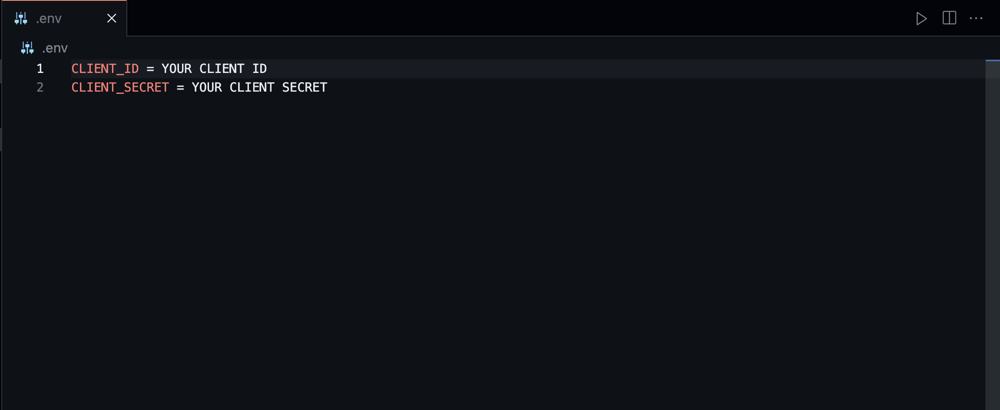
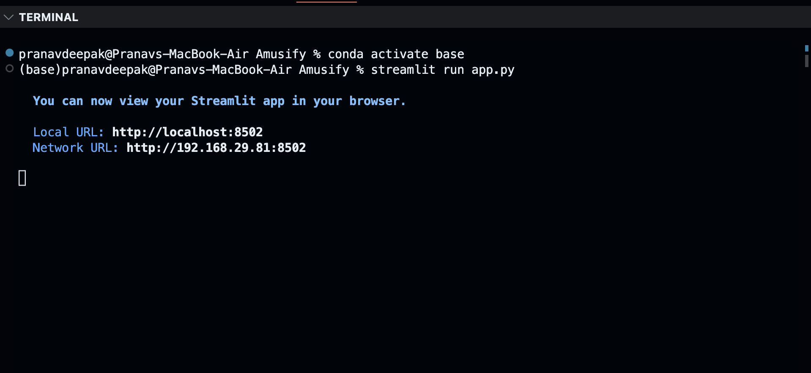

### Amusify
---
##### Amusify is a Basic Music Analytics and Recommendation App which lets users find songs of their interests and similarities.
##### This is app is solely based on Artists , Albums and Tracks registered on Spotify and uses the Spotify Developer API to connect to your Spotify Account 
##### This app is custom built to avoid sharing your Spotify Credentials with third party apps like Volt.fm
##### The Apps runs locally on your computer after you download and set it up
---
#### 1 - Requirements 
1. Python > = 3.8
2. Streamlit
3. Spotipy
4. Matplotlib and Seaborn
5. PIL
6. dotenv , requests and pandas 
7. A Spotify Account with Developer Settings Enabled
---
#### 2 - Usage 
1. First clone or download the project from GitHub
2. Create a virtual environment ( better to create a venv to avoid dependency issues ) and install the necessary python packages
3. Open Spotify Developer Dashboard and Create a new App
4. Copy the Client ID and Client Secret
5. Create a .env file and paste your Client ID and Client Secret as shown below
   
6. Next Open the terminal and Activate the python environment which has the above libraries intalled ( if you use venv source activate **/path to venv/**)
7. Type the command `streamlit run app.py`
   
8. Open the displayed URL in the terminal to access the App
---
#### 3 - Features
1. This App is a rudimentary version of a bigger aspiration to build an intuitive Music analytics and recommendation app
2. You can select Track , Album or Artist to Perform Custom Searches
3. Currentlty the features of the app are limited
  1. Top Songs and Albums of Artists
  2. Song Features cum Analysis and Recommendation based on selected track
  3. Songs in the Albums with Previews
4.  ***New Features Coming Soon......***
---
#### 4 - Updates 

> 1 . Profile Information and Recommendation based on Listening Activity
<br/>


> 2 . Custom Built Recommendation System using Hybrid Deep Learning methods of Content-Based Extraction and Collaborative Filtering

---
#### Stay Tuned for Updates 
```
Built with Care By
PD
```
---
